# Sequence Diagram — Polibatam Verify
 
Disusun **per use case scenario** (UC-01 s.d. UC-34) berdasarkan *Use Case Scenario*, *Class Diagram*, *Dokumen Arsitektur*, *FR & BR* (FR-01 s.d. FR-66, BR-01 s.d. BR-69), dan *Keputusan Klarifikasi Scope* (K-01 s.d. K-38).
 
**Konvensi:**
- Ditulis dalam **PlantUML** (`@startuml … @enduml`). Nomor pesan otomatis (`autonumber`).
- Penomoran **SD-xx sama dengan UC-xx**, sehingga SD-12 adalah sequence diagram untuk UC-12.
- Jenis partisipan:
| Simbol | Jenis | Contoh |
|---|---|---|
| `actor` | Pengguna | Calon Peserta, Admin SILAU |
| `boundary` | Antarmuka | Web (Blade), Aplikasi Mobile |
| `control` | Controller, Action, Service, Query, Policy (sesuai Class Diagram §3) | `VerifikasiDokumen`, `TerbitkanNpd` |
| `entity` | Model domain | `Pendaftaran`, `Tagihan` |
| `database` | MySQL | — |
| `queue` | Antrean notifikasi/job | `Notifier` |
| `participant` | Sistem eksternal | Layanan Email, Penyimpanan File |
 
- Alur alternatif dan eksepsi di *use case scenario* (A1, E1, …) digambar dengan blok `alt` / `else`.
- `group Transaksi DB` menandai langkah atomik (NFR-27). Notifikasi dikirim setelah transaksi berhasil (*after commit*, K-34).
- `ref over` menunjuk sequence diagram lain untuk *use case* yang di-*include* (SD-31, SD-32, SD-34).
- Endpoint API mengikuti Dokumen Arsitektur §6.4–§6.5. Nama rute web (mis. `/pendaftaran/{id}/ajukan`) bersifat ilustratif dan dapat disesuaikan saat implementasi (K-35).
---
 
## Daftar Sequence Diagram
 
| SD | Use Case | Aktor Utama | Kanal |
|---|---|---|---|
| SD-01 | Melihat katalog peminatan | Pengunjung | Web |
| SD-02 | Registrasi akun | Pengunjung | Web |
| SD-03 | Login (dengan 2FA) | Semua pengguna | Web, Mobile |
| SD-04 | Reset password | Semua pengguna | Web |
| SD-05 | Mengisi & mengajukan formulir | Calon Peserta | Web |
| SD-06 | Mengunggah berkas persyaratan | Calon Peserta | Web |
| SD-07 | Merevisi berkas yang ditolak | Calon Peserta | Web |
| SD-08 | Memantau status & notifikasi | Calon Peserta / Peserta Didik | Web |
| SD-09 | Melihat tagihan | Calon Peserta / Peserta Didik | Web |
| SD-10 | Mengunggah bukti pembayaran | Calon Peserta / Peserta Didik | Web |
| SD-11 | Mengisi data rekening refund | Calon Peserta / Peserta Didik | Web |
| SD-12 | Memverifikasi berkas pendaftaran | Admin SILAU | Web, Mobile |
| SD-13 | Memverifikasi pembayaran | Admin Keuangan | Web, Mobile |
| SD-14 | Memproses refund | Admin Keuangan | Web |
| SD-15 | Rekap & ekspor laporan keuangan | Admin Keuangan | Web |
| SD-16 | Mengelola track & peminatan | Admin Track | Web |
| SD-17 | Mengelola tarif berversi | Admin Track | Web |
| SD-18 | Mengatur kuota peminatan | Admin Track | Web |
| SD-19 | Memantau keterisian kuota | Admin Track, Super Admin | Web |
| SD-20 | Mengelola periode | Super Admin | Web |
| SD-21 | Menjalankan rollover semester | Super Admin | Web |
| SD-22 | Mengevaluasi kuota & membatalkan peminatan | Super Admin | Web |
| SD-23 | Menetapkan jatuh tempo manual | Super Admin | Web |
| SD-24 | Mengoreksi status Lunas | Super Admin | Web |
| SD-25 | Mengelola akun & role | Super Admin | Web |
| SD-26 | Menelusuri audit log | Super Admin | Web |
| SD-27 | Mengelola konten landing page | Super Admin | Web |
| SD-28 | Membatalkan pendaftaran kedaluwarsa | Penjadwal Sistem | — |
| SD-29 | Menutup periode pendaftaran (termasuk Draf & arsip) | Penjadwal Sistem | — |
| SD-30 | Mengirim pengingat, peringatan & membersihkan ekspor | Penjadwal Sistem | — |
| SD-31 | Mempromosikan Daftar Tunggu (*included*) | Sistem | — |
| SD-32 | Menerbitkan NPD & tagihan Semester 1 (*included*) | Sistem | — |
| SD-33 | Melihat & mengekspor data pendaftaran | Admin | Web |
| SD-34 | Membuat & mengunduh arsip periode | Sistem, Admin SILAU / Super Admin | Web |
 
---
 
## SD-01 — Melihat Katalog Peminatan
 
**UC-01** · FR-08, FR-09 · BR-07, BR-17, BR-27, BR-55 · NFR-15
 
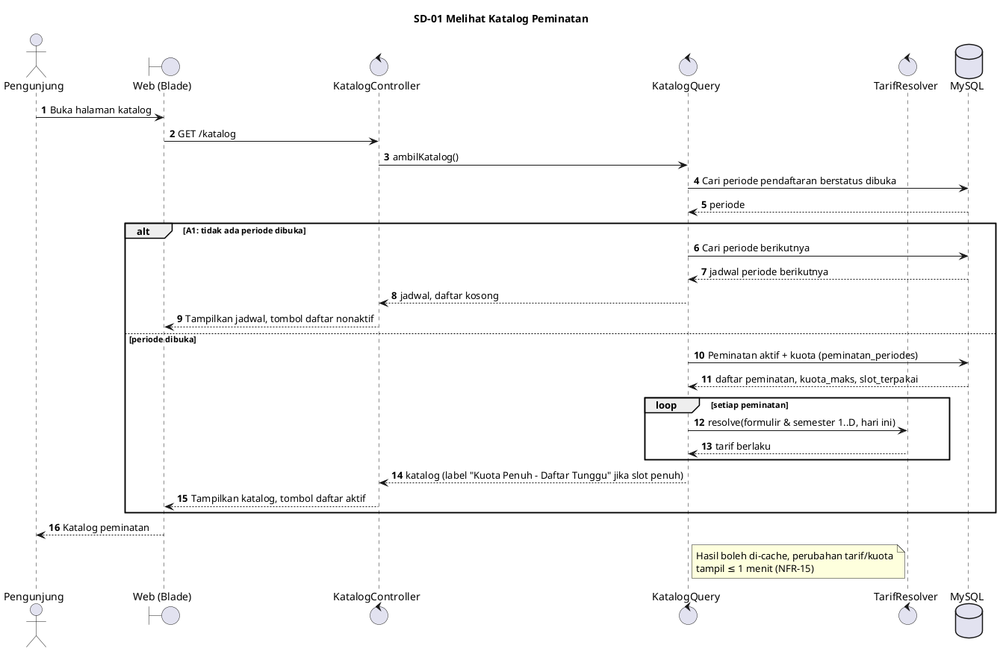
```plantuml
@startuml
title SD-01 Melihat Katalog Peminatan
autonumber
actor "Pengunjung" as P
boundary "Web (Blade)" as UI
control "KatalogController" as C
control "KatalogQuery" as Q
control "TarifResolver" as TR
database "MySQL" as DB
 
P -> UI : Buka halaman katalog
UI -> C : GET /katalog
C -> Q : ambilKatalog()
Q -> DB : Cari periode pendaftaran berstatus dibuka
DB --> Q : periode
alt A1: tidak ada periode dibuka
  Q -> DB : Cari periode berikutnya
  DB --> Q : jadwal periode berikutnya
  Q --> C : jadwal, daftar kosong
  C --> UI : Tampilkan jadwal, tombol daftar nonaktif
else periode dibuka
  Q -> DB : Peminatan aktif + kuota (peminatan_periodes)
  DB --> Q : daftar peminatan, kuota_maks, slot_terpakai
  loop setiap peminatan
    Q -> TR : resolve(formulir & semester 1..D, hari ini)
    TR --> Q : tarif berlaku
  end
  Q --> C : katalog (label "Kuota Penuh – Daftar Tunggu" jika slot penuh)
  C --> UI : Tampilkan katalog, tombol daftar aktif
end
UI --> P : Katalog peminatan
note right of Q : Hasil boleh di-cache, perubahan tarif/kuota\ntampil ≤ 1 menit (NFR-15)
@enduml
```
 
---
 
## SD-02 — Registrasi Akun
 
**UC-02** · FR-01, FR-02 · BR-01, BR-02 · NFR-02, NFR-11
 
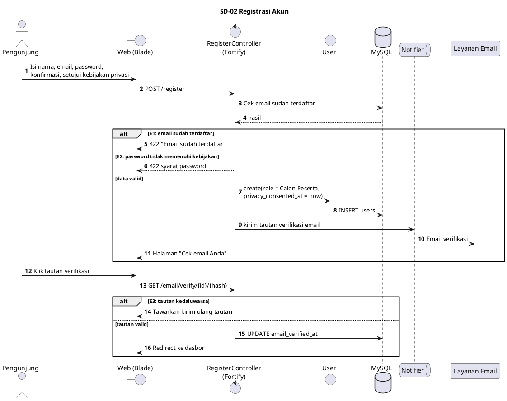
```plantuml
@startuml
title SD-02 Registrasi Akun
autonumber
actor "Pengunjung" as P
boundary "Web (Blade)" as UI
control "RegisterController\n(Fortify)" as C
entity "User" as U
database "MySQL" as DB
queue "Notifier" as N
participant "Layanan Email" as E
 
P -> UI : Isi nama, email, password,\nkonfirmasi, setujui kebijakan privasi
UI -> C : POST /register
C -> DB : Cek email sudah terdaftar
DB --> C : hasil
alt E1: email sudah terdaftar
  C --> UI : 422 "Email sudah terdaftar"
else E2: password tidak memenuhi kebijakan
  C --> UI : 422 syarat password
else data valid
  C -> U : create(role = Calon Peserta,\nprivacy_consented_at = now)
  U -> DB : INSERT users
  C -> N : kirim tautan verifikasi email
  N -> E : Email verifikasi
  C --> UI : Halaman "Cek email Anda"
end
 
P -> UI : Klik tautan verifikasi
UI -> C : GET /email/verify/{id}/{hash}
alt E3: tautan kedaluwarsa
  C --> UI : Tawarkan kirim ulang tautan
else tautan valid
  C -> DB : UPDATE email_verified_at
  C --> UI : Redirect ke dasbor
end
@enduml
```
 
---
 
## SD-03 — Login (dengan 2FA)
 
**UC-03** · FR-03, FR-04, FR-59, FR-60 · BR-03, BR-59, BR-60 · NFR-03, NFR-09, NFR-47
 
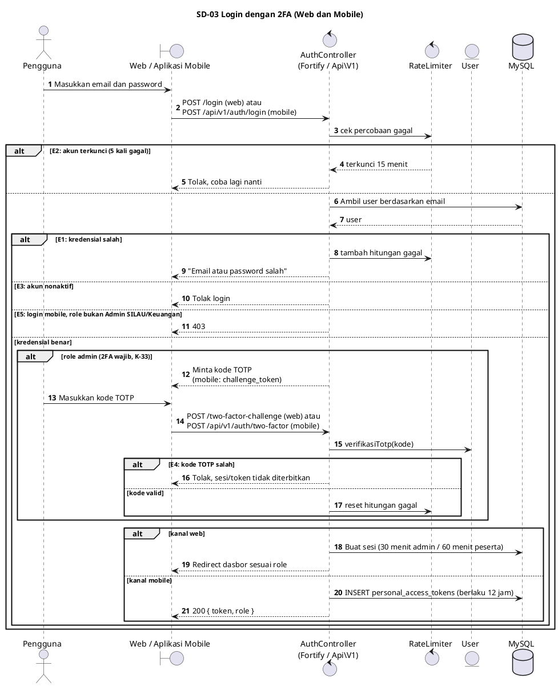
```plantuml
@startuml
title SD-03 Login dengan 2FA (Web dan Mobile)
autonumber
actor "Pengguna" as P
boundary "Web / Aplikasi Mobile" as UI
control "AuthController\n(Fortify / Api\\V1)" as C
control "RateLimiter" as RL
entity "User" as U
database "MySQL" as DB
 
P -> UI : Masukkan email dan password
UI -> C : POST /login (web) atau\nPOST /api/v1/auth/login (mobile)
C -> RL : cek percobaan gagal
alt E2: akun terkunci (5 kali gagal)
  RL --> C : terkunci 15 menit
  C --> UI : Tolak, coba lagi nanti
else
  C -> DB : Ambil user berdasarkan email
  DB --> C : user
  alt E1: kredensial salah
    C -> RL : tambah hitungan gagal
    C --> UI : "Email atau password salah"
  else E3: akun nonaktif
    C --> UI : Tolak login
  else E5: login mobile, role bukan Admin SILAU/Keuangan
    C --> UI : 403
  else kredensial benar
    alt role admin (2FA wajib, K-33)
      C --> UI : Minta kode TOTP\n(mobile: challenge_token)
      P -> UI : Masukkan kode TOTP
      UI -> C : POST /two-factor-challenge (web) atau\nPOST /api/v1/auth/two-factor (mobile)
      C -> U : verifikasiTotp(kode)
      alt E4: kode TOTP salah
        C --> UI : Tolak, sesi/token tidak diterbitkan
      else kode valid
        C -> RL : reset hitungan gagal
      end
    end
    alt kanal web
      C -> DB : Buat sesi (30 menit admin / 60 menit peserta)
      C --> UI : Redirect dasbor sesuai role
    else kanal mobile
      C -> DB : INSERT personal_access_tokens (berlaku 12 jam)
      C --> UI : 200 { token, role }
    end
  end
end
@enduml
```
 
---
 
## SD-04 — Reset Password
 
**UC-04** · FR-05 · BR-03 · NFR-08 · K-32
 
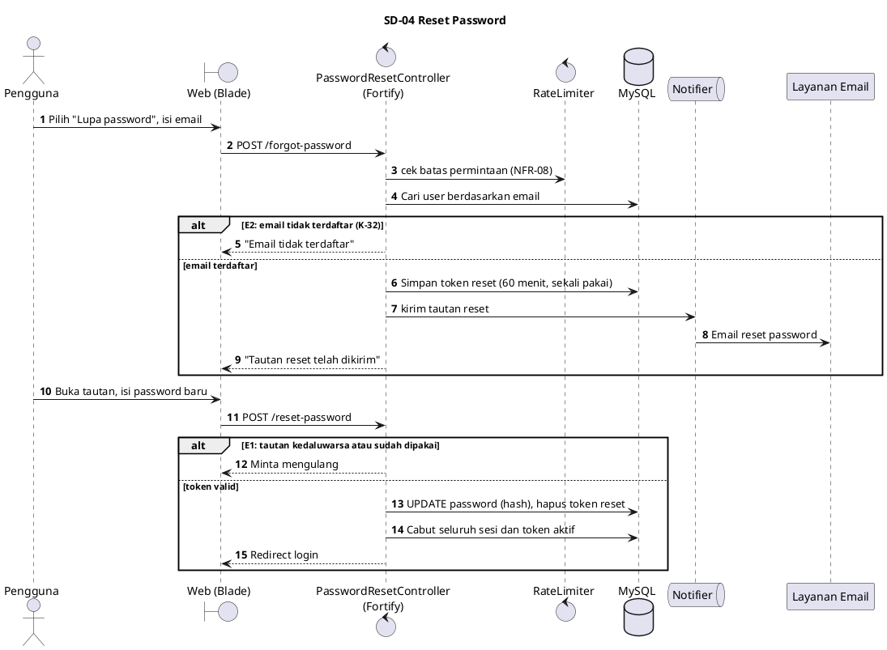
```plantuml
@startuml
title SD-04 Reset Password
autonumber
actor "Pengguna" as P
boundary "Web (Blade)" as UI
control "PasswordResetController\n(Fortify)" as C
control "RateLimiter" as RL
database "MySQL" as DB
queue "Notifier" as N
participant "Layanan Email" as E
 
P -> UI : Pilih "Lupa password", isi email
UI -> C : POST /forgot-password
C -> RL : cek batas permintaan (NFR-08)
C -> DB : Cari user berdasarkan email
alt E2: email tidak terdaftar (K-32)
  C --> UI : "Email tidak terdaftar"
else email terdaftar
  C -> DB : Simpan token reset (60 menit, sekali pakai)
  C -> N : kirim tautan reset
  N -> E : Email reset password
  C --> UI : "Tautan reset telah dikirim"
end
 
P -> UI : Buka tautan, isi password baru
UI -> C : POST /reset-password
alt E1: tautan kedaluwarsa atau sudah dipakai
  C --> UI : Minta mengulang
else token valid
  C -> DB : UPDATE password (hash), hapus token reset
  C -> DB : Cabut seluruh sesi dan token aktif
  C --> UI : Redirect login
end
@enduml
```
 
---
 
## SD-05 — Mengisi & Mengajukan Formulir Pendaftaran
 
**UC-05** · FR-11–13, FR-26, FR-28 · BR-07–09, BR-11, BR-29, BR-32, BR-62, BR-64, BR-68
 
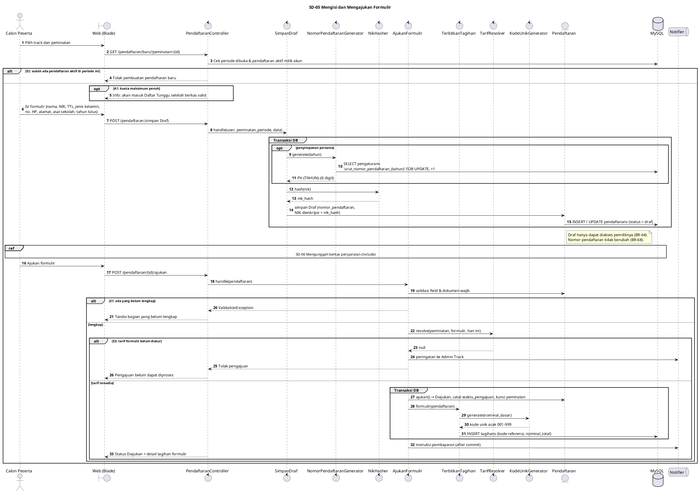
```plantuml
@startuml
title SD-05 Mengisi dan Mengajukan Formulir
autonumber
actor "Calon Peserta" as P
boundary "Web (Blade)" as UI
control "PendaftaranController" as C
control "SimpanDraf" as SD
control "NomorPendaftaranGenerator" as NP
control "NikHasher" as NH
control "AjukanFormulir" as AF
control "TerbitkanTagihan" as TT
control "TarifResolver" as TR
control "KodeUnikGenerator" as KU
entity "Pendaftaran" as PD
database "MySQL" as DB
queue "Notifier" as N
 
P -> UI : Pilih track dan peminatan
UI -> C : GET /pendaftaran/baru?peminatan={id}
C -> DB : Cek periode dibuka & pendaftaran aktif milik akun
alt E2: sudah ada pendaftaran aktif di periode ini
  C --> UI : Tolak pembuatan pendaftaran baru
else
  opt A1: kuota maksimum penuh
    C --> UI : Info: akan masuk Daftar Tunggu setelah berkas valid
  end
  P -> UI : Isi formulir (nama, NIK, TTL, jenis kelamin,\nno. HP, alamat, asal sekolah, tahun lulus)
  UI -> C : POST /pendaftaran (simpan Draf)
  C -> SD : handle(user, peminatan_periode, data)
  group Transaksi DB
    opt penyimpanan pertama
      SD -> NP : generate(tahun)
      NP -> DB : SELECT pengaturans\n'urut_nomor_pendaftaran_{tahun}' FOR UPDATE, +1
      NP --> SD : PV-{TAHUN}-{6 digit}
    end
    SD -> NH : hash(nik)
    NH --> SD : nik_hash
    SD -> PD : simpan Draf (nomor_pendaftaran,\nNIK dienkripsi + nik_hash)
    PD -> DB : INSERT / UPDATE pendaftarans (status = draf)
  end
  note right of PD : Draf hanya dapat diakses pemiliknya (BR-64).\nNomor pendaftaran tidak berubah (BR-68).
  ref over P, DB : SD-06 Mengunggah berkas persyaratan (include)
  P -> UI : Ajukan formulir
  UI -> C : POST /pendaftaran/{id}/ajukan
  C -> AF : handle(pendaftaran)
  AF -> PD : validasi field & dokumen wajib
  alt E1: ada yang belum lengkap
    AF --> C : ValidationException
    C --> UI : Tandai bagian yang belum lengkap
  else lengkap
    AF -> TR : resolve(peminatan, formulir, hari ini)
    alt E3: tarif formulir belum diatur
      TR --> AF : null
      AF -> N : peringatan ke Admin Track
      AF --> C : Tolak pengajuan
      C --> UI : Pengajuan belum dapat diproses
    else tarif tersedia
      group Transaksi DB
        AF -> PD : ajukan() → Diajukan, catat waktu_pengajuan, kunci peminatan
        AF -> TT : formulir(pendaftaran)
        TT -> KU : generate(nominal_dasar)
        KU --> TT : kode unik acak 001–999
        TT -> DB : INSERT tagihans (kode referensi, nominal_total)
      end
      AF -> N : instruksi pembayaran (after commit)
      C --> UI : Status Diajukan + detail tagihan formulir
    end
  end
end
@enduml
```
 
---
 
## SD-06 — Mengunggah Berkas Persyaratan
 
**UC-06** · FR-14 · BR-11, BR-12 · NFR-07
 
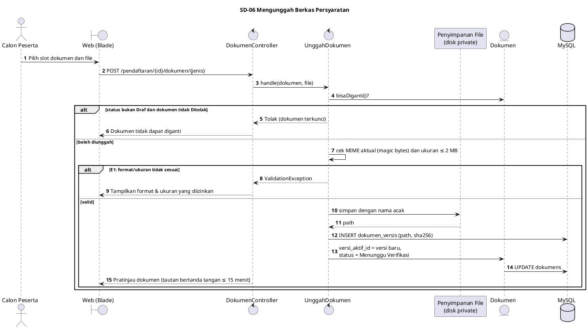
```plantuml
@startuml
title SD-06 Mengunggah Berkas Persyaratan
autonumber
actor "Calon Peserta" as P
boundary "Web (Blade)" as UI
control "DokumenController" as C
control "UnggahDokumen" as UD
participant "Penyimpanan File\n(disk private)" as FS
entity "Dokumen" as D
database "MySQL" as DB
 
P -> UI : Pilih slot dokumen dan file
UI -> C : POST /pendaftaran/{id}/dokumen/{jenis}
C -> UD : handle(dokumen, file)
UD -> D : bisaDiganti()?
alt status bukan Draf dan dokumen tidak Ditolak
  UD --> C : Tolak (dokumen terkunci)
  C --> UI : Dokumen tidak dapat diganti
else boleh diunggah
  UD -> UD : cek MIME aktual (magic bytes) dan ukuran ≤ 2 MB
  alt E1: format/ukuran tidak sesuai
    UD --> C : ValidationException
    C --> UI : Tampilkan format & ukuran yang diizinkan
  else valid
    UD -> FS : simpan dengan nama acak
    FS --> UD : path
    UD -> DB : INSERT dokumen_versis (path, sha256)
    UD -> D : versi_aktif_id = versi baru,\nstatus = Menunggu Verifikasi
    D -> DB : UPDATE dokumens
    C --> UI : Pratinjau dokumen (tautan bertanda tangan ≤ 15 menit)
  end
end
@enduml
```
 
---
 
## SD-07 — Merevisi Berkas yang Ditolak
 
**UC-07** · FR-16, FR-17 · BR-14
 
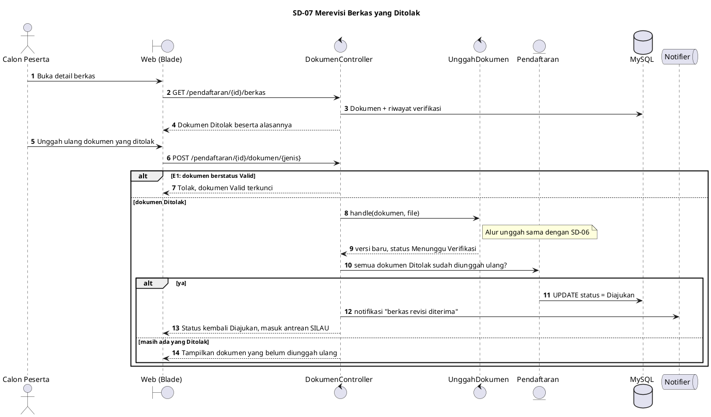
```plantuml
@startuml
title SD-07 Merevisi Berkas yang Ditolak
autonumber
actor "Calon Peserta" as P
boundary "Web (Blade)" as UI
control "DokumenController" as C
control "UnggahDokumen" as UD
entity "Pendaftaran" as PD
database "MySQL" as DB
queue "Notifier" as N
 
P -> UI : Buka detail berkas
UI -> C : GET /pendaftaran/{id}/berkas
C -> DB : Dokumen + riwayat verifikasi
C --> UI : Dokumen Ditolak beserta alasannya
P -> UI : Unggah ulang dokumen yang ditolak
UI -> C : POST /pendaftaran/{id}/dokumen/{jenis}
alt E1: dokumen berstatus Valid
  C --> UI : Tolak, dokumen Valid terkunci
else dokumen Ditolak
  C -> UD : handle(dokumen, file)
  note right of UD : Alur unggah sama dengan SD-06
  UD --> C : versi baru, status Menunggu Verifikasi
  C -> PD : semua dokumen Ditolak sudah diunggah ulang?
  alt ya
    PD -> DB : UPDATE status = Diajukan
    C -> N : notifikasi "berkas revisi diterima"
    C --> UI : Status kembali Diajukan, masuk antrean SILAU
  else masih ada yang Ditolak
    C --> UI : Tampilkan dokumen yang belum diunggah ulang
  end
end
@enduml
```
 
---
 
## SD-08 — Memantau Status Pendaftaran & Notifikasi
 
**UC-08** · FR-15, FR-53 · BR-17, BR-18, BR-22, BR-56, BR-65
 
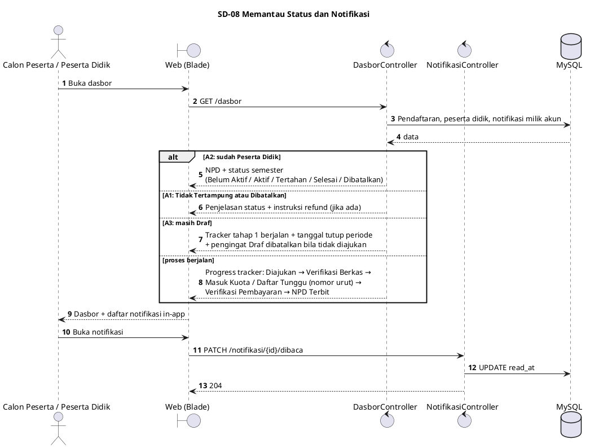
```plantuml
@startuml
title SD-08 Memantau Status dan Notifikasi
autonumber
actor "Calon Peserta / Peserta Didik" as P
boundary "Web (Blade)" as UI
control "DasborController" as C
control "NotifikasiController" as NC
database "MySQL" as DB
 
P -> UI : Buka dasbor
UI -> C : GET /dasbor
C -> DB : Pendaftaran, peserta didik, notifikasi milik akun
DB --> C : data
alt A2: sudah Peserta Didik
  C --> UI : NPD + status semester\n(Belum Aktif / Aktif / Tertahan / Selesai / Dibatalkan)
else A1: Tidak Tertampung atau Dibatalkan
  C --> UI : Penjelasan status + instruksi refund (jika ada)
else A3: masih Draf
  C --> UI : Tracker tahap 1 berjalan + tanggal tutup periode\n+ pengingat Draf dibatalkan bila tidak diajukan
else proses berjalan
  C --> UI : Progress tracker: Diajukan → Verifikasi Berkas →\nMasuk Kuota / Daftar Tunggu (nomor urut) →\nVerifikasi Pembayaran → NPD Terbit
end
UI --> P : Dasbor + daftar notifikasi in-app
P -> UI : Buka notifikasi
UI -> NC : PATCH /notifikasi/{id}/dibaca
NC -> DB : UPDATE read_at
NC --> UI : 204
@enduml
```
 
---
 
## SD-09 — Melihat Tagihan
 
**UC-09** · FR-37 · BR-35, BR-57
 
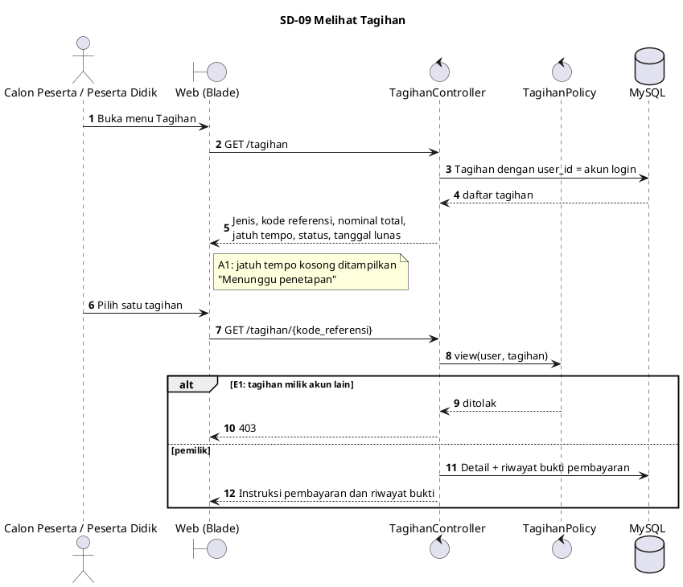
```plantuml
@startuml
title SD-09 Melihat Tagihan
autonumber
actor "Calon Peserta / Peserta Didik" as P
boundary "Web (Blade)" as UI
control "TagihanController" as C
control "TagihanPolicy" as POL
database "MySQL" as DB
 
P -> UI : Buka menu Tagihan
UI -> C : GET /tagihan
C -> DB : Tagihan dengan user_id = akun login
DB --> C : daftar tagihan
C --> UI : Jenis, kode referensi, nominal total,\njatuh tempo, status, tanggal lunas
note right of UI : A1: jatuh tempo kosong ditampilkan\n"Menunggu penetapan"
P -> UI : Pilih satu tagihan
UI -> C : GET /tagihan/{kode_referensi}
C -> POL : view(user, tagihan)
alt E1: tagihan milik akun lain
  POL --> C : ditolak
  C --> UI : 403
else pemilik
  C -> DB : Detail + riwayat bukti pembayaran
  C --> UI : Instruksi pembayaran dan riwayat bukti
end
@enduml
```
 
---
 
## SD-10 — Mengunggah Bukti Pembayaran
 
**UC-10** · FR-29, FR-30 · BR-36, BR-37
 
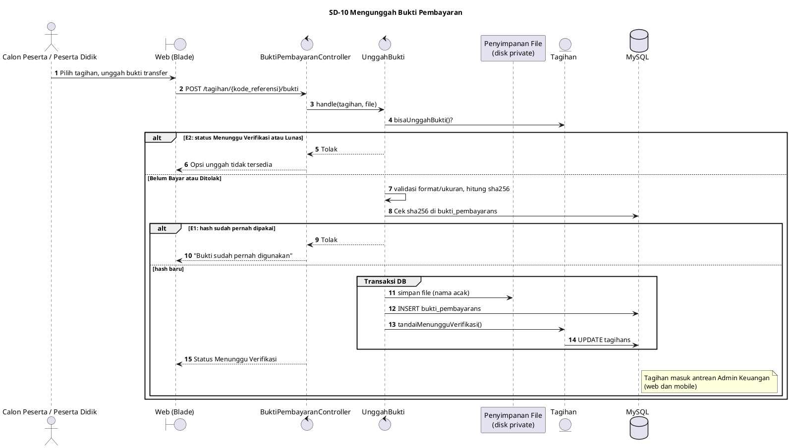
```plantuml
@startuml
title SD-10 Mengunggah Bukti Pembayaran
autonumber
actor "Calon Peserta / Peserta Didik" as P
boundary "Web (Blade)" as UI
control "BuktiPembayaranController" as C
control "UnggahBukti" as UB
participant "Penyimpanan File\n(disk private)" as FS
entity "Tagihan" as T
database "MySQL" as DB
 
P -> UI : Pilih tagihan, unggah bukti transfer
UI -> C : POST /tagihan/{kode_referensi}/bukti
C -> UB : handle(tagihan, file)
UB -> T : bisaUnggahBukti()?
alt E2: status Menunggu Verifikasi atau Lunas
  UB --> C : Tolak
  C --> UI : Opsi unggah tidak tersedia
else Belum Bayar atau Ditolak
  UB -> UB : validasi format/ukuran, hitung sha256
  UB -> DB : Cek sha256 di bukti_pembayarans
  alt E1: hash sudah pernah dipakai
    UB --> C : Tolak
    C --> UI : "Bukti sudah pernah digunakan"
  else hash baru
    group Transaksi DB
      UB -> FS : simpan file (nama acak)
      UB -> DB : INSERT bukti_pembayarans
      UB -> T : tandaiMenungguVerifikasi()
      T -> DB : UPDATE tagihans
    end
    C --> UI : Status Menunggu Verifikasi
    note right of DB : Tagihan masuk antrean Admin Keuangan\n(web dan mobile)
  end
end
@enduml
```
 
---
 
## SD-11 — Mengisi Data Rekening Refund
 
**UC-11** · FR-43, FR-62 · BR-50, BR-51, BR-63
 
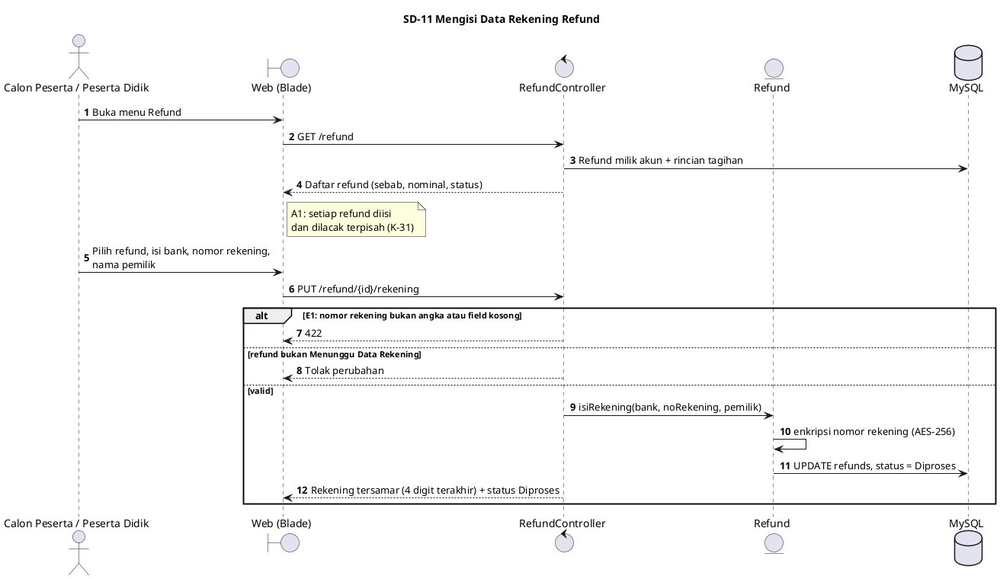
```plantuml
@startuml
title SD-11 Mengisi Data Rekening Refund
autonumber
actor "Calon Peserta / Peserta Didik" as P
boundary "Web (Blade)" as UI
control "RefundController" as C
entity "Refund" as R
database "MySQL" as DB
 
P -> UI : Buka menu Refund
UI -> C : GET /refund
C -> DB : Refund milik akun + rincian tagihan
C --> UI : Daftar refund (sebab, nominal, status)
note right of UI : A1: setiap refund diisi\ndan dilacak terpisah (K-31)
P -> UI : Pilih refund, isi bank, nomor rekening,\nnama pemilik
UI -> C : PUT /refund/{id}/rekening
alt E1: nomor rekening bukan angka atau field kosong
  C --> UI : 422
else refund bukan Menunggu Data Rekening
  C --> UI : Tolak perubahan
else valid
  C -> R : isiRekening(bank, noRekening, pemilik)
  R -> R : enkripsi nomor rekening (AES-256)
  R -> DB : UPDATE refunds, status = Diproses
  C --> UI : Rekening tersamar (4 digit terakhir) + status Diproses
end
@enduml
```
 
---
 
## SD-12 — Memverifikasi Berkas Pendaftaran
 
**UC-12** · FR-18–22, FR-60, FR-61 · BR-13, BR-16, BR-17, BR-61, BR-64, BR-66 · NFR-27
 
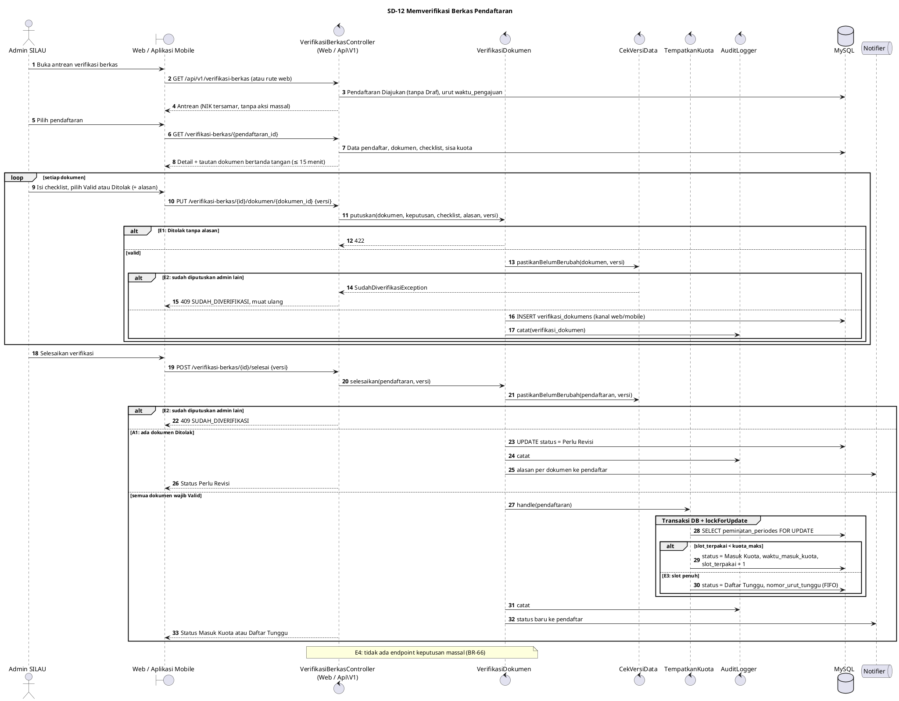
```plantuml
@startuml
title SD-12 Memverifikasi Berkas Pendaftaran
autonumber
actor "Admin SILAU" as A
boundary "Web / Aplikasi Mobile" as UI
control "VerifikasiBerkasController\n(Web / Api\\V1)" as C
control "VerifikasiDokumen" as VD
control "CekVersiData" as CV
control "TempatkanKuota" as TK
control "AuditLogger" as AL
database "MySQL" as DB
queue "Notifier" as N
 
A -> UI : Buka antrean verifikasi berkas
UI -> C : GET /api/v1/verifikasi-berkas (atau rute web)
C -> DB : Pendaftaran Diajukan (tanpa Draf), urut waktu_pengajuan
C --> UI : Antrean (NIK tersamar, tanpa aksi massal)
A -> UI : Pilih pendaftaran
UI -> C : GET /verifikasi-berkas/{pendaftaran_id}
C -> DB : Data pendaftar, dokumen, checklist, sisa kuota
C --> UI : Detail + tautan dokumen bertanda tangan (≤ 15 menit)
 
loop setiap dokumen
  A -> UI : Isi checklist, pilih Valid atau Ditolak (+ alasan)
  UI -> C : PUT /verifikasi-berkas/{id}/dokumen/{dokumen_id} {versi}
  C -> VD : putuskan(dokumen, keputusan, checklist, alasan, versi)
  alt E1: Ditolak tanpa alasan
    VD --> C : 422
  else valid
    VD -> CV : pastikanBelumBerubah(dokumen, versi)
    alt E2: sudah diputuskan admin lain
      CV --> C : SudahDiverifikasiException
      C --> UI : 409 SUDAH_DIVERIFIKASI, muat ulang
    else
      VD -> DB : INSERT verifikasi_dokumens (kanal web/mobile)
      VD -> AL : catat(verifikasi_dokumen)
    end
  end
end
 
A -> UI : Selesaikan verifikasi
UI -> C : POST /verifikasi-berkas/{id}/selesai {versi}
C -> VD : selesaikan(pendaftaran, versi)
VD -> CV : pastikanBelumBerubah(pendaftaran, versi)
alt E2: sudah diputuskan admin lain
  C --> UI : 409 SUDAH_DIVERIFIKASI
else A1: ada dokumen Ditolak
  VD -> DB : UPDATE status = Perlu Revisi
  VD -> AL : catat
  VD -> N : alasan per dokumen ke pendaftar
  C --> UI : Status Perlu Revisi
else semua dokumen wajib Valid
  VD -> TK : handle(pendaftaran)
  group Transaksi DB + lockForUpdate
    TK -> DB : SELECT peminatan_periodes FOR UPDATE
    alt slot_terpakai < kuota_maks
      TK -> DB : status = Masuk Kuota, waktu_masuk_kuota,\nslot_terpakai + 1
    else E3: slot penuh
      TK -> DB : status = Daftar Tunggu, nomor_urut_tunggu (FIFO)
    end
  end
  VD -> AL : catat
  VD -> N : status baru ke pendaftar
  C --> UI : Status Masuk Kuota atau Daftar Tunggu
end
note over C, VD : E4: tidak ada endpoint keputusan massal (BR-66)
@enduml
```
 
---
 
## SD-13 — Memverifikasi Pembayaran
 
**UC-13** · FR-31–35, FR-60, FR-61 · BR-38–42, BR-46, BR-61, BR-66
 
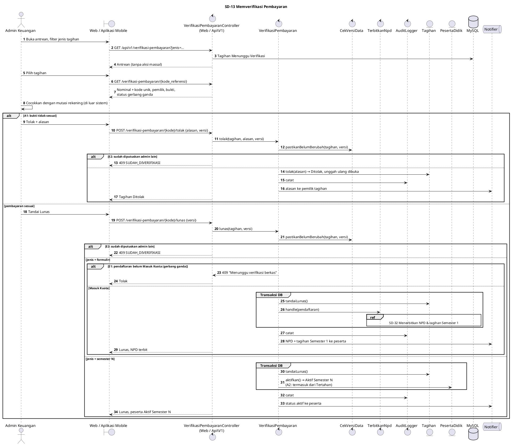
```plantuml
@startuml
title SD-13 Memverifikasi Pembayaran
autonumber
actor "Admin Keuangan" as A
boundary "Web / Aplikasi Mobile" as UI
control "VerifikasiPembayaranController\n(Web / Api\\V1)" as C
control "VerifikasiPembayaran" as VP
control "CekVersiData" as CV
control "TerbitkanNpd" as TN
control "AuditLogger" as AL
entity "Tagihan" as T
entity "PesertaDidik" as PD
database "MySQL" as DB
queue "Notifier" as N
 
A -> UI : Buka antrean, filter jenis tagihan
UI -> C : GET /api/v1/verifikasi-pembayaran?jenis=...
C -> DB : Tagihan Menunggu Verifikasi
C --> UI : Antrean (tanpa aksi massal)
A -> UI : Pilih tagihan
UI -> C : GET /verifikasi-pembayaran/{kode_referensi}
C --> UI : Nominal + kode unik, pemilik, bukti,\nstatus gerbang ganda
A -> A : Cocokkan dengan mutasi rekening (di luar sistem)
 
alt A1: bukti tidak sesuai
  A -> UI : Tolak + alasan
  UI -> C : POST /verifikasi-pembayaran/{kode}/tolak {alasan, versi}
  C -> VP : tolak(tagihan, alasan, versi)
  VP -> CV : pastikanBelumBerubah(tagihan, versi)
  alt E2: sudah diputuskan admin lain
    C --> UI : 409 SUDAH_DIVERIFIKASI
  else
    VP -> T : tolak(alasan) → Ditolak, unggah ulang dibuka
    VP -> AL : catat
    VP -> N : alasan ke pemilik tagihan
    C --> UI : Tagihan Ditolak
  end
else pembayaran sesuai
  A -> UI : Tandai Lunas
  UI -> C : POST /verifikasi-pembayaran/{kode}/lunas {versi}
  C -> VP : lunas(tagihan, versi)
  VP -> CV : pastikanBelumBerubah(tagihan, versi)
  alt E2: sudah diputuskan admin lain
    C --> UI : 409 SUDAH_DIVERIFIKASI
  else jenis = formulir
    alt E1: pendaftaran belum Masuk Kuota (gerbang ganda)
      VP --> C : 409 "Menunggu verifikasi berkas"
      C --> UI : Tolak
    else Masuk Kuota
      group Transaksi DB
        VP -> T : tandaiLunas()
        VP -> TN : handle(pendaftaran)
        ref over TN, DB : SD-32 Menerbitkan NPD & tagihan Semester 1
      end
      VP -> AL : catat
      VP -> N : NPD + tagihan Semester 1 ke peserta
      C --> UI : Lunas, NPD terbit
    end
  else jenis = semester N
    group Transaksi DB
      VP -> T : tandaiLunas()
      VP -> PD : aktifkan() → Aktif Semester N\n(A2: termasuk dari Tertahan)
    end
    VP -> AL : catat
    VP -> N : status aktif ke peserta
    C --> UI : Lunas, peserta Aktif Semester N
  end
end
@enduml
```
 
---
 
## SD-14 — Memproses Refund
 
**UC-14** · FR-42, FR-44, FR-62 · BR-48–51, BR-63 · K-34
 
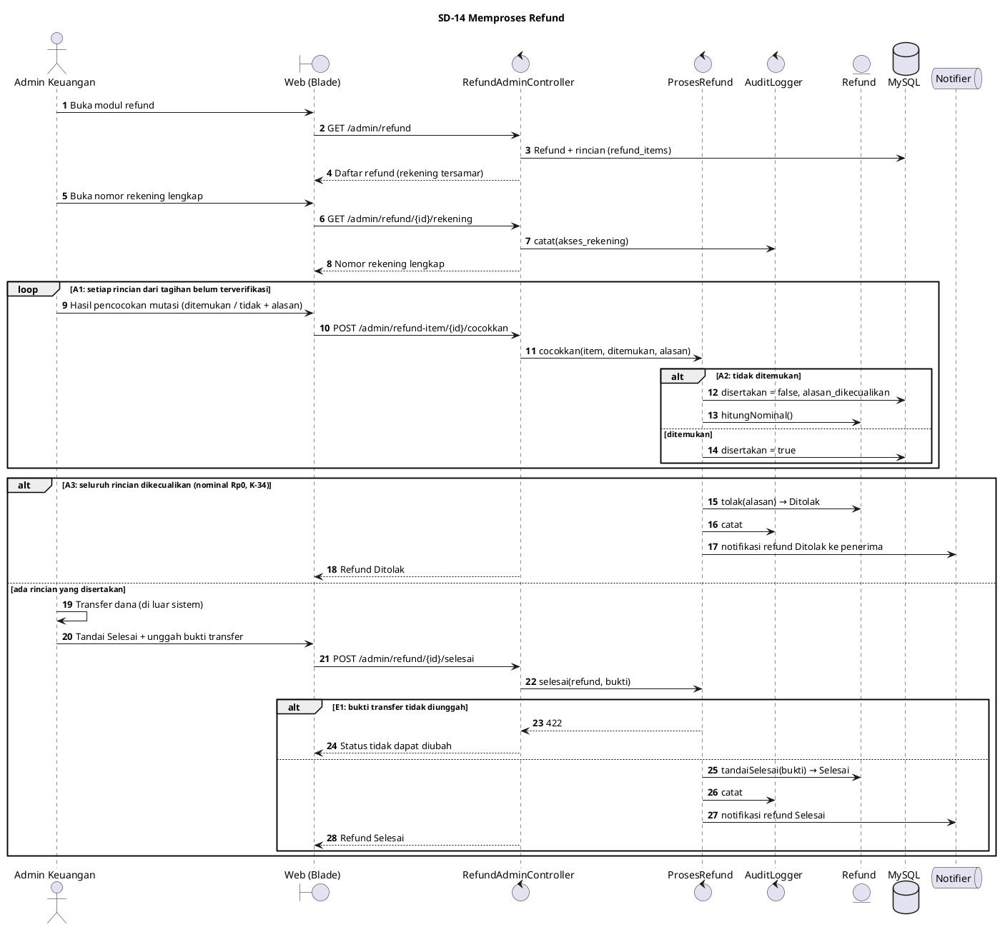
```plantuml
@startuml
title SD-14 Memproses Refund
autonumber
actor "Admin Keuangan" as A
boundary "Web (Blade)" as UI
control "RefundAdminController" as C
control "ProsesRefund" as PR
control "AuditLogger" as AL
entity "Refund" as R
database "MySQL" as DB
queue "Notifier" as N
 
A -> UI : Buka modul refund
UI -> C : GET /admin/refund
C -> DB : Refund + rincian (refund_items)
C --> UI : Daftar refund (rekening tersamar)
A -> UI : Buka nomor rekening lengkap
UI -> C : GET /admin/refund/{id}/rekening
C -> AL : catat(akses_rekening)
C --> UI : Nomor rekening lengkap
 
loop A1: setiap rincian dari tagihan belum terverifikasi
  A -> UI : Hasil pencocokan mutasi (ditemukan / tidak + alasan)
  UI -> C : POST /admin/refund-item/{id}/cocokkan
  C -> PR : cocokkan(item, ditemukan, alasan)
  alt A2: tidak ditemukan
    PR -> DB : disertakan = false, alasan_dikecualikan
    PR -> R : hitungNominal()
  else ditemukan
    PR -> DB : disertakan = true
  end
end
 
alt A3: seluruh rincian dikecualikan (nominal Rp0, K-34)
  PR -> R : tolak(alasan) → Ditolak
  PR -> AL : catat
  PR -> N : notifikasi refund Ditolak ke penerima
  C --> UI : Refund Ditolak
else ada rincian yang disertakan
  A -> A : Transfer dana (di luar sistem)
  A -> UI : Tandai Selesai + unggah bukti transfer
  UI -> C : POST /admin/refund/{id}/selesai
  C -> PR : selesai(refund, bukti)
  alt E1: bukti transfer tidak diunggah
    PR --> C : 422
    C --> UI : Status tidak dapat diubah
  else
    PR -> R : tandaiSelesai(bukti) → Selesai
    PR -> AL : catat
    PR -> N : notifikasi refund Selesai
    C --> UI : Refund Selesai
  end
end
@enduml
```
 
---
 
## SD-15 — Melihat Rekap & Mengekspor Laporan Keuangan
 
**UC-15** · FR-38 · NFR-19, NFR-39
 
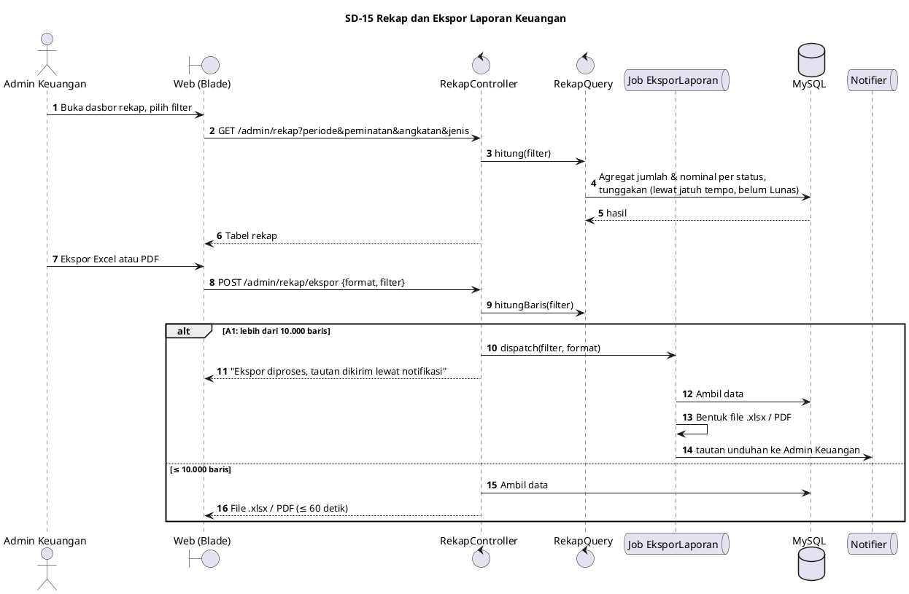
```plantuml
@startuml
title SD-15 Rekap dan Ekspor Laporan Keuangan
autonumber
actor "Admin Keuangan" as A
boundary "Web (Blade)" as UI
control "RekapController" as C
control "RekapQuery" as Q
queue "Job EksporLaporan" as J
database "MySQL" as DB
queue "Notifier" as N
 
A -> UI : Buka dasbor rekap, pilih filter
UI -> C : GET /admin/rekap?periode&peminatan&angkatan&jenis
C -> Q : hitung(filter)
Q -> DB : Agregat jumlah & nominal per status,\ntunggakan (lewat jatuh tempo, belum Lunas)
DB --> Q : hasil
C --> UI : Tabel rekap
A -> UI : Ekspor Excel atau PDF
UI -> C : POST /admin/rekap/ekspor {format, filter}
C -> Q : hitungBaris(filter)
alt A1: lebih dari 10.000 baris
  C -> J : dispatch(filter, format)
  C --> UI : "Ekspor diproses, tautan dikirim lewat notifikasi"
  J -> DB : Ambil data
  J -> J : Bentuk file .xlsx / PDF
  J -> N : tautan unduhan ke Admin Keuangan
else ≤ 10.000 baris
  C -> DB : Ambil data
  C --> UI : File .xlsx / PDF (≤ 60 detik)
end
@enduml
```
 
---
 
## SD-16 — Mengelola Track & Peminatan
 
**UC-16** · FR-45, FR-46 · BR-43, BR-52, BR-53
 
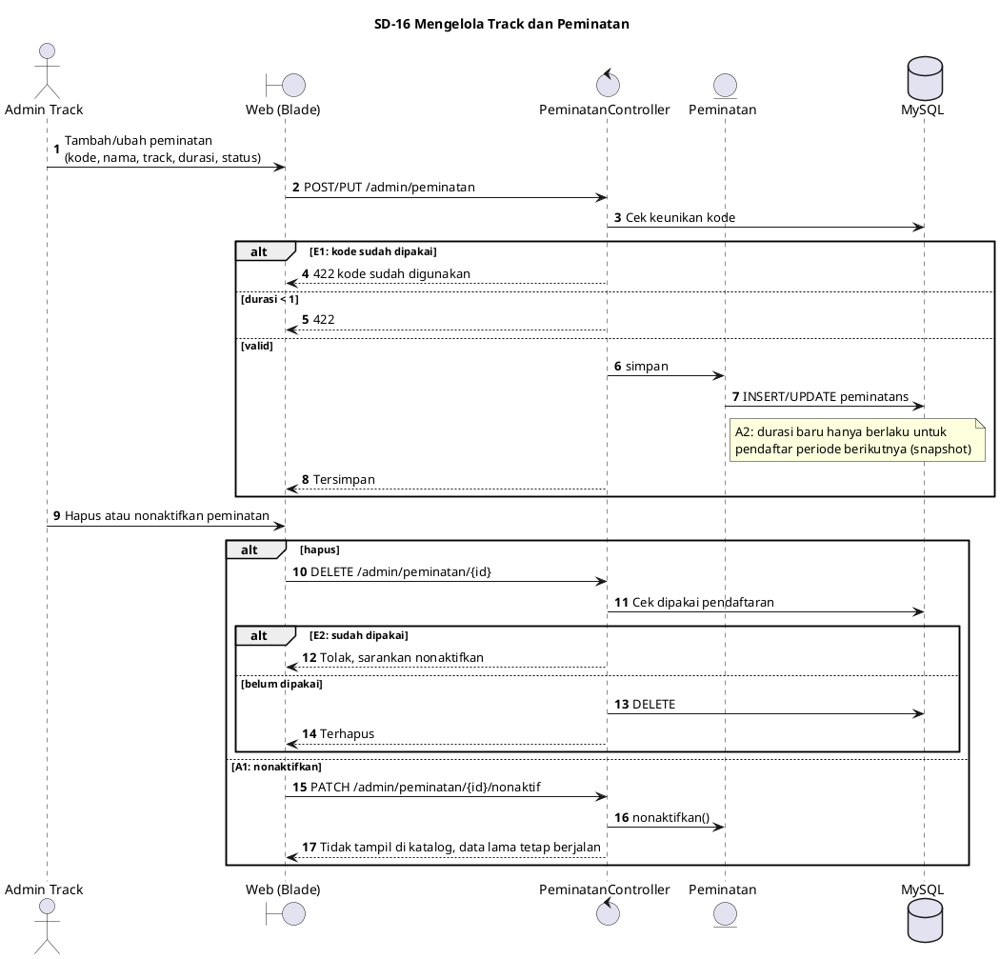
```plantuml
@startuml
title SD-16 Mengelola Track dan Peminatan
autonumber
actor "Admin Track" as A
boundary "Web (Blade)" as UI
control "PeminatanController" as C
entity "Peminatan" as PM
database "MySQL" as DB
 
A -> UI : Tambah/ubah peminatan\n(kode, nama, track, durasi, status)
UI -> C : POST/PUT /admin/peminatan
C -> DB : Cek keunikan kode
alt E1: kode sudah dipakai
  C --> UI : 422 kode sudah digunakan
else durasi < 1
  C --> UI : 422
else valid
  C -> PM : simpan
  PM -> DB : INSERT/UPDATE peminatans
  note right of PM : A2: durasi baru hanya berlaku untuk\npendaftar periode berikutnya (snapshot)
  C --> UI : Tersimpan
end
 
A -> UI : Hapus atau nonaktifkan peminatan
alt hapus
  UI -> C : DELETE /admin/peminatan/{id}
  C -> DB : Cek dipakai pendaftaran
  alt E2: sudah dipakai
    C --> UI : Tolak, sarankan nonaktifkan
  else belum dipakai
    C -> DB : DELETE
    C --> UI : Terhapus
  end
else A1: nonaktifkan
  UI -> C : PATCH /admin/peminatan/{id}/nonaktif
  C -> PM : nonaktifkan()
  C --> UI : Tidak tampil di katalog, data lama tetap berjalan
end
@enduml
```
 
---
 
## SD-17 — Mengelola Tarif Berversi
 
**UC-17** · FR-47 · BR-25–28
 
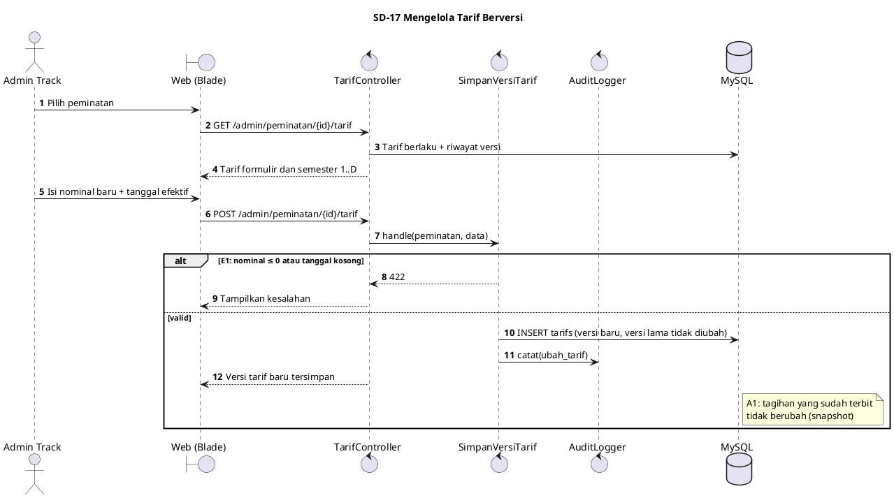
```plantuml
@startuml
title SD-17 Mengelola Tarif Berversi
autonumber
actor "Admin Track" as A
boundary "Web (Blade)" as UI
control "TarifController" as C
control "SimpanVersiTarif" as SV
control "AuditLogger" as AL
database "MySQL" as DB
 
A -> UI : Pilih peminatan
UI -> C : GET /admin/peminatan/{id}/tarif
C -> DB : Tarif berlaku + riwayat versi
C --> UI : Tarif formulir dan semester 1..D
A -> UI : Isi nominal baru + tanggal efektif
UI -> C : POST /admin/peminatan/{id}/tarif
C -> SV : handle(peminatan, data)
alt E1: nominal ≤ 0 atau tanggal kosong
  SV --> C : 422
  C --> UI : Tampilkan kesalahan
else valid
  SV -> DB : INSERT tarifs (versi baru, versi lama tidak diubah)
  SV -> AL : catat(ubah_tarif)
  C --> UI : Versi tarif baru tersimpan
  note right of DB : A1: tagihan yang sudah terbit\ntidak berubah (snapshot)
end
@enduml
```
 
---
 
## SD-18 — Mengatur Kuota Peminatan
 
**UC-18** · FR-48 · BR-15, BR-20
 
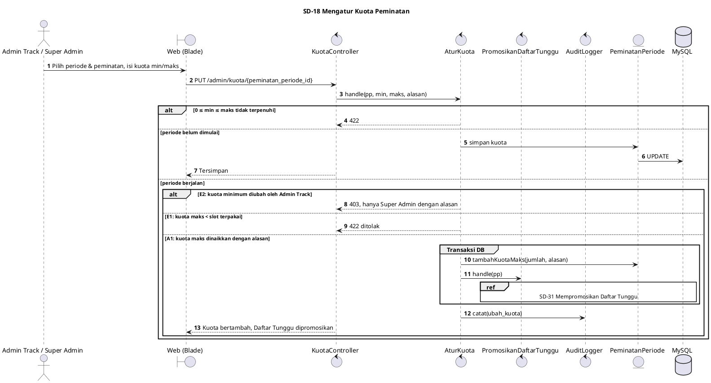
```plantuml
@startuml
title SD-18 Mengatur Kuota Peminatan
autonumber
actor "Admin Track / Super Admin" as A
boundary "Web (Blade)" as UI
control "KuotaController" as C
control "AturKuota" as AK
control "PromosikanDaftarTunggu" as PDT
control "AuditLogger" as AL
entity "PeminatanPeriode" as PP
database "MySQL" as DB
 
A -> UI : Pilih periode & peminatan, isi kuota min/maks
UI -> C : PUT /admin/kuota/{peminatan_periode_id}
C -> AK : handle(pp, min, maks, alasan)
alt 0 ≤ min ≤ maks tidak terpenuhi
  AK --> C : 422
else periode belum dimulai
  AK -> PP : simpan kuota
  PP -> DB : UPDATE
  C --> UI : Tersimpan
else periode berjalan
  alt E2: kuota minimum diubah oleh Admin Track
    AK --> C : 403, hanya Super Admin dengan alasan
  else E1: kuota maks < slot terpakai
    AK --> C : 422 ditolak
  else A1: kuota maks dinaikkan dengan alasan
    group Transaksi DB
      AK -> PP : tambahKuotaMaks(jumlah, alasan)
      AK -> PDT : handle(pp)
      ref over PDT, DB : SD-31 Mempromosikan Daftar Tunggu
    end
    AK -> AL : catat(ubah_kuota)
    C --> UI : Kuota bertambah, Daftar Tunggu dipromosikan
  end
end
@enduml
```
 
---
 
## SD-19 — Memantau Keterisian Kuota
 
**UC-19** · FR-49 · BR-23
 
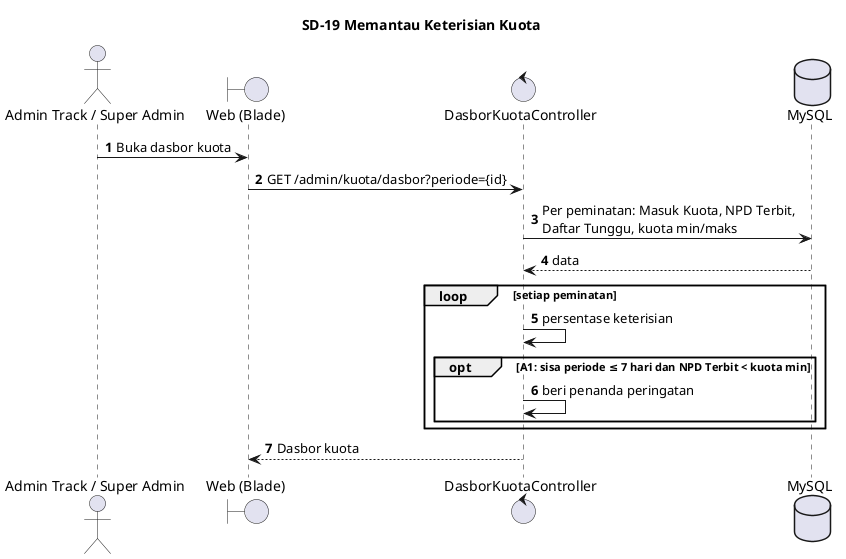
```plantuml
@startuml
title SD-19 Memantau Keterisian Kuota
autonumber
actor "Admin Track / Super Admin" as A
boundary "Web (Blade)" as UI
control "DasborKuotaController" as C
database "MySQL" as DB
 
A -> UI : Buka dasbor kuota
UI -> C : GET /admin/kuota/dasbor?periode={id}
C -> DB : Per peminatan: Masuk Kuota, NPD Terbit,\nDaftar Tunggu, kuota min/maks
DB --> C : data
loop setiap peminatan
  C -> C : persentase keterisian
  opt A1: sisa periode ≤ 7 hari dan NPD Terbit < kuota min
    C -> C : beri penanda peringatan
  end
end
C --> UI : Dasbor kuota
@enduml
```
 
---
 
## SD-20 — Mengelola Periode Pendaftaran & Akademik
 
**UC-20** · FR-50 · BR-35, BR-54
 
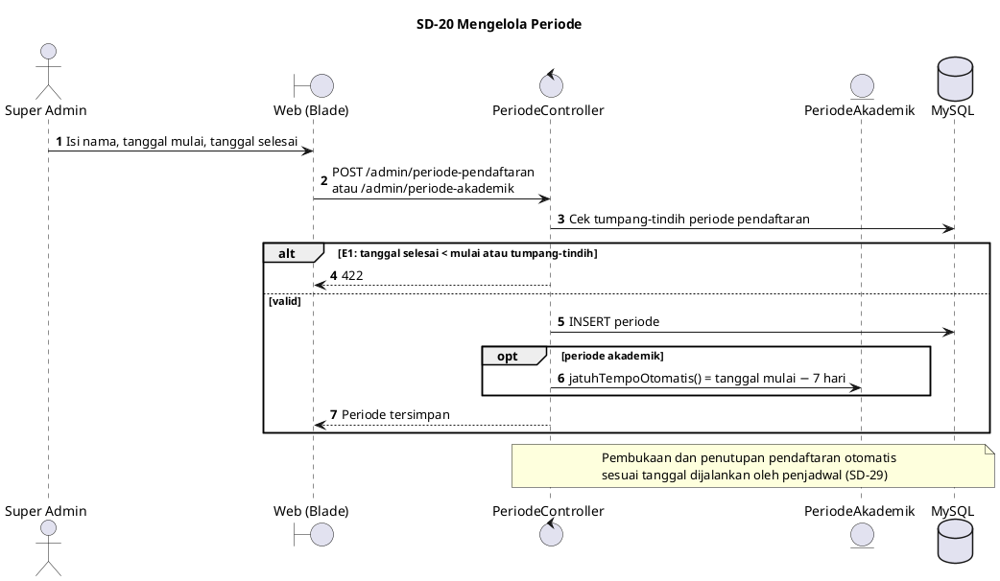
```plantuml
@startuml
title SD-20 Mengelola Periode
autonumber
actor "Super Admin" as A
boundary "Web (Blade)" as UI
control "PeriodeController" as C
entity "PeriodeAkademik" as PA
database "MySQL" as DB
 
A -> UI : Isi nama, tanggal mulai, tanggal selesai
UI -> C : POST /admin/periode-pendaftaran\natau /admin/periode-akademik
C -> DB : Cek tumpang-tindih periode pendaftaran
alt E1: tanggal selesai < mulai atau tumpang-tindih
  C --> UI : 422
else valid
  C -> DB : INSERT periode
  opt periode akademik
    C -> PA : jatuhTempoOtomatis() = tanggal mulai − 7 hari
  end
  C --> UI : Periode tersimpan
end
note over C, DB : Pembukaan dan penutupan pendaftaran otomatis\nsesuai tanggal dijalankan oleh penjadwal (SD-29)
@enduml
```
 
---
 
## SD-21 — Menjalankan Rollover Semester
 
**UC-21** · FR-27, FR-51, FR-52 · BR-44–46 · NFR-18, NFR-27
 
```plantuml
@startuml
title SD-21 Menjalankan Rollover Semester
autonumber
actor "Super Admin" as A
boundary "Web (Blade)" as UI
control "RolloverController" as C
control "PratinjauRollover" as PR
queue "Job JalankanRollover" as J
control "TerbitkanTagihan" as TT
control "AuditLogger" as AL
entity "PeriodeAkademik" as PA
database "MySQL" as DB
queue "Notifier" as N
 
A -> UI : Buka menu rollover, pilih periode akademik
UI -> C : GET /admin/rollover/{periode_id}/pratinjau
C -> PA : sudahRollover()?
alt E1: sudah pernah di-rollover
  C --> UI : Tolak eksekusi ulang
else
  C -> PR : handle(periode)
  PR -> DB : Peserta Aktif / Belum Aktif + status tagihan semester berjalan
  PR --> C : Ringkasan: naik semester, Selesai, Tertahan
  C --> UI : Pratinjau (≤ 30 detik)
  A -> UI : Konfirmasi eksekusi
  UI -> C : POST /admin/rollover/{periode_id}
  C -> J : dispatch(periode)
  C --> UI : "Rollover sedang diproses"
  group Transaksi DB (gagal = rollback seluruhnya, E2)
    loop setiap peserta
      alt tagihan semester N belum Lunas
        J -> DB : status = Tertahan, tanpa tagihan baru
      else N = durasi
        J -> DB : status = Selesai Masa Program
      else N < durasi
        J -> DB : semester_berjalan = N+1, status = Belum Aktif
        J -> TT : semester(peserta, N+1, periode)
        alt E3: tarif semester N+1 belum diatur
          TT --> J : lewati, catat peringatan
        else A1: terbit pada/setelah H-7
          TT -> DB : INSERT tagihan, jatuh_tempo = NULL
        else terbit sebelum H-7
          TT -> DB : INSERT tagihan, jatuh_tempo = H-7
        end
      end
    end
    J -> PA : rollover_dijalankan_pada = now
  end
  J -> AL : catat(rollover, ringkasan)
  J -> N : notifikasi peserta; peringatan tarif kosong ke\nAdmin Track & Super Admin; tagihan tanpa jatuh tempo ke Super Admin
end
@enduml
```
 
---
 
## SD-22 — Mengevaluasi Kuota & Membatalkan Peminatan
 
**UC-22** · FR-39–42 · BR-23, BR-24, BR-47, BR-48 · K-34
 
```plantuml
@startuml
title SD-22 Mengevaluasi Kuota dan Membatalkan Peminatan
autonumber
actor "Super Admin" as A
boundary "Web (Blade)" as UI
control "EvaluasiKuotaController" as C
control "BatalkanPeminatan" as BP
control "HitungRefund" as HR
control "AuditLogger" as AL
entity "PeminatanPeriode" as PP
database "MySQL" as DB
queue "Notifier" as N
 
A -> UI : Buka evaluasi kuota
UI -> C : GET /admin/evaluasi-kuota?periode={id}
C -> DB : NPD Terbit vs kuota minimum per peminatan
C --> UI : Daftar peminatan, tandai yang tidak memenuhi
A -> UI : Pilih peminatan + dasar pembatalan (+ alasan)
UI -> C : POST /admin/peminatan-periode/{id}/batalkan
C -> BP : handle(pp, dasar, alasan)
alt E1: dasar kuota minimum, tetapi kuota terpenuhi
  BP --> C : 422 ditolak
else A1: dasar kesepakatan tanpa alasan
  BP --> C : 422 alasan wajib
else valid
  group Transaksi DB
    BP -> PP : batalkan(dasar, alasan)
    BP -> DB : Pendaftaran terkait = Dibatalkan
    BP -> DB : Peserta Didik terkait = Dibatalkan (K-34)
    BP -> DB : Tagihan belum Lunas = Dibatalkan
    loop setiap pendaftar yang sudah membayar
      BP -> HR : buat(pendaftaran, peminatan_dibatalkan)
      HR -> DB : INSERT refunds + refund_items\n(tagihan belum pernah di-refund, nominal dasar)
    end
  end
  BP -> AL : catat(pembatalan_peminatan)
  BP -> N : notifikasi pembatalan + instruksi refund
  C --> UI : Peminatan dibatalkan
end
note right of DB : Arsip periode tidak berubah;\nisinya status per waktu penutupan (BR-69)
@enduml
```
 
---
 
## SD-23 — Menetapkan Jatuh Tempo Manual
 
**UC-23** · FR-57 · BR-35 · K-32
 
```plantuml
@startuml
title SD-23 Menetapkan Jatuh Tempo Manual
autonumber
actor "Super Admin" as A
boundary "Web (Blade)" as UI
control "JatuhTempoController" as C
control "TetapkanJatuhTempo" as TJ
control "AuditLogger" as AL
database "MySQL" as DB
queue "Notifier" as N
 
A -> UI : Buka daftar tagihan tanpa jatuh tempo
UI -> C : GET /admin/tagihan/tanpa-jatuh-tempo
C -> DB : Tagihan semester dengan jatuh_tempo NULL
C --> UI : Daftar tagihan
A -> UI : Pilih tagihan (satu/massal), isi tanggal
UI -> C : POST /admin/tagihan/jatuh-tempo {ids, tanggal}
C -> TJ : handle(tagihan, tanggal)
group Transaksi DB
  TJ -> DB : UPDATE jatuh_tempo, jatuh_tempo_manual = true
  TJ -> AL : catat(penetapan_jatuh_tempo)
end
alt A1: tanggal lebih awal dari hari ini (K-32)
  note right of TJ : Diterima. Tagihan langsung dihitung\nlewat jatuh tempo, tanpa pengingat H-7/H-1
else tanggal mendatang
  note right of TJ : Pengingat H-7 dan H-1 berjalan (SD-30)
end
TJ -> N : notifikasi jatuh tempo ke pemilik tagihan
C --> UI : Jatuh tempo tersimpan
@enduml
```
 
---
 
## SD-24 — Mengoreksi Status Lunas
 
**UC-24** · FR-36 · BR-40
 
```plantuml
@startuml
title SD-24 Mengoreksi Status Lunas
autonumber
actor "Super Admin" as A
boundary "Web (Blade)" as UI
control "KoreksiTagihanController" as C
control "AuditLogger" as AL
entity "Tagihan" as T
database "MySQL" as DB
queue "Notifier" as N
 
A -> UI : Buka tagihan berstatus Lunas
UI -> C : GET /admin/tagihan/{kode_referensi}
C --> UI : Detail tagihan
A -> UI : Pilih koreksi status + isi alasan
UI -> C : POST /admin/tagihan/{kode}/koreksi {status, alasan}
alt E1: alasan kosong
  C --> UI : 422
else valid
  group Transaksi DB
    C -> T : ubah status sesuai koreksi
    T -> DB : UPDATE tagihans
    C -> AL : catat(koreksi_lunas, nilai sebelum/sesudah, alasan)
  end
  C -> N : notifikasi ke pemilik tagihan
  C --> UI : Koreksi tersimpan
end
@enduml
```
 
---
 
## SD-25 — Mengelola Akun & Role
 
**UC-25** · FR-06, FR-07, FR-59 · BR-04, BR-05, BR-59, BR-60
 
```plantuml
@startuml
title SD-25 Mengelola Akun dan Role
autonumber
actor "Super Admin" as A
actor "Admin Baru" as B
boundary "Web (Blade)" as UI
control "AkunController" as C
control "AuditLogger" as AL
entity "User" as U
database "MySQL" as DB
queue "Notifier" as N
participant "Layanan Email" as E
 
A -> UI : Buat akun admin (nama, email, role)
UI -> C : POST /admin/akun
C -> U : create(role admin, belum aktif)
U -> DB : INSERT users + model_has_roles
C -> AL : catat(buat_akun)
C -> N : undangan aktivasi
N -> E : Email undangan
B -> UI : Buka tautan aktivasi, atur password
UI -> C : POST /aktivasi
C --> UI : Wajib daftarkan authenticator (K-33)
B -> UI : Pindai QR, masukkan kode TOTP
UI -> C : POST /user/confirmed-two-factor-authentication
C -> U : simpan two_factor_secret, recovery codes
C --> UI : Akun aktif
 
A -> UI : Ubah role atau nonaktifkan akun
UI -> C : PATCH /admin/akun/{id}
alt E1: Super Admin terakhir diturunkan/dinonaktifkan
  C --> UI : Tolak
else valid
  group Transaksi DB
    C -> U : ubah role / nonaktifkan()
    C -> U : cabutSemuaToken() (sesi web + token mobile)
    C -> AL : catat(ubah_akun)
  end
  C --> UI : Perubahan tersimpan
end
@enduml
```
 
---
 
## SD-26 — Menelusuri Audit Log
 
**UC-26** · FR-55, FR-56 · BR-58 · NFR-31
 
```plantuml
@startuml
title SD-26 Menelusuri Audit Log
autonumber
actor "Super Admin" as A
boundary "Web (Blade)" as UI
control "AuditLogController" as C
database "MySQL" as DB
 
A -> UI : Buka audit log, isi filter\n(pelaku, aktivitas, entitas, kanal, tanggal)
UI -> C : GET /admin/audit-log?filter...
C -> DB : SELECT audit_logs (user DB hanya INSERT/SELECT)
DB --> C : entri
C --> UI : Pelaku, role, waktu, kanal,\nnilai sebelum/sesudah, alasan
note right of UI : E1: tidak ada tombol ubah atau hapus.\nIntegritas dicek harian lewat hash chain (SD-30)
@enduml
```
 
---
 
## SD-27 — Mengelola Konten Landing Page
 
**UC-27** · FR-10 · BR-55
 
```plantuml
@startuml
title SD-27 Mengelola Konten Landing Page
autonumber
actor "Super Admin" as A
boundary "Web (Blade)" as UI
control "KontenCmsController" as C
control "AuditLogger" as AL
entity "KontenCms" as K
database "MySQL" as DB
 
A -> UI : Buka CMS, pilih bagian
UI -> C : GET /admin/cms/{bagian}
alt E1: role bukan Super Admin
  C --> UI : 403
else
  C --> UI : Editor konten
  A -> UI : Edit konten, pratinjau
  UI -> C : POST /admin/cms/{bagian}/pratinjau
  C --> UI : Tampilan pratinjau
  A -> UI : Terbitkan
  UI -> C : POST /admin/cms/{bagian}/terbitkan
  C -> K : terbitkan()
  K -> DB : UPDATE konten_cms (status terbit)
  C -> AL : catat(ubah_cms)
  C --> UI : Konten tampil di landing page
end
note right of DB : Tarif dan kuota tetap diambil\ndari data master (SD-01)
@enduml
```
 
---
 
## SD-28 — Membatalkan Pendaftaran Kedaluwarsa
 
**UC-28** · FR-24 · BR-21 · NFR-25
 
```plantuml
@startuml
title SD-28 Membatalkan Pendaftaran Kedaluwarsa
autonumber
participant "Penjadwal Sistem\n(setiap jam)" as S
control "pendaftaran:batalkan-kedaluwarsa" as CMD
control "BatalkanKedaluwarsa" as BK
control "PromosikanDaftarTunggu" as PDT
database "MySQL" as DB
queue "Notifier" as N
 
S -> CMD : jalankan
CMD -> BK : handle()
BK -> DB : Masuk Kuota > 7 hari, tagihan formulir\nBelum Bayar/Ditolak (A1: kecuali Menunggu Verifikasi)
DB --> BK : daftar pendaftaran
loop setiap pendaftaran kedaluwarsa
  group Transaksi DB + lockForUpdate
    BK -> DB : status pendaftaran = Dibatalkan
    BK -> DB : tagihan formulir = Dibatalkan
    BK -> DB : slot_terpakai − 1
    BK -> PDT : handle(peminatan_periode)
    ref over PDT, DB : SD-31 Mempromosikan Daftar Tunggu
  end
  BK -> N : notifikasi pembatalan
end
BK --> CMD : jumlah dibatalkan
CMD -> DB : catat eksekusi
note right of CMD : E1: gagal → coba ulang otomatis,\nalert setelah 3 kegagalan berturut-turut
@enduml
```
 
---
 
## SD-29 — Menutup Periode Pendaftaran
 
**UC-29** · FR-25, FR-65 · BR-22, BR-47, BR-65, BR-69 · K-37, K-38
 
```plantuml
@startuml
title SD-29 Menutup Periode Pendaftaran
autonumber
participant "Penjadwal Sistem\n(setiap 15 menit)" as S
control "periode:tutup" as CMD
control "TutupPeriode" as TP
control "HitungRefund" as HR
control "AuditLogger" as AL
queue "Job BuatArsipPeriode" as J
database "MySQL" as DB
queue "Notifier" as N
 
S -> CMD : jalankan
CMD -> DB : Periode dibuka yang melewati tanggal selesai
alt tidak ada
  CMD --> S : selesai
else ada periode
  CMD -> TP : handle(periode)
  group Transaksi DB
    TP -> DB : status periode = Ditutup, ditutup_pada
    TP -> DB : Daftar Tunggu → Tidak Tertampung
    loop setiap Tidak Tertampung yang sudah membayar formulir
      TP -> HR : buat(pendaftaran, tidak_tertampung)
      HR -> DB : INSERT refunds + refund_items
      note right of HR : A1: rincian dari tagihan Menunggu Verifikasi\nwajib dicocokkan Admin Keuangan (SD-14)
    end
  end
  group Transaksi DB per batch (idempoten, BR-65)
    TP -> DB : Draf pada periode ini → Dibatalkan,\nalasan_batal = "Periode pendaftaran ditutup\nsebelum formulir diajukan"
    note right of DB : Draf belum punya tagihan,\ntidak ada pembatalan tagihan maupun refund
  end
  TP -> AL : catat(tutup_periode, batal_draf_periode_ditutup,\njumlah per status)
  TP -> N : notifikasi Tidak Tertampung + instruksi refund
  TP -> N : notifikasi pemilik Draf yang dibatalkan
  TP -> J : dispatch(periode) — after commit (FR-65)
  ref over J, DB : SD-34 Membuat arsip periode
  TP -> N : notifikasi Super Admin: evaluasi kuota minimum (SD-22)
end
@enduml
```
 
---
 
## SD-30 — Mengirim Pengingat, Peringatan & Membersihkan Ekspor
 
**UC-30** · FR-54, FR-57, FR-58, FR-64 · BR-35, BR-44, BR-57, BR-67 · NFR-26, NFR-50
 
```plantuml
@startuml
title SD-30 Mengirim Pengingat, Peringatan, dan Membersihkan Ekspor
autonumber
participant "Penjadwal Sistem" as S
control "tagihan:kirim-pengingat" as P1
control "rollover:peringatan" as P2
control "tagihan:cek-tanpa-jatuh-tempo" as P3
control "ekspor:bersihkan" as P4
participant "Penyimpanan File\n(disk ekspor)" as FS
database "MySQL" as DB
queue "Notifier" as N
participant "Layanan Email" as E
 
== 07.00 WIB ==
S -> P1 : jalankan
P1 -> DB : Tagihan Belum Bayar/Ditolak dengan jatuh tempo\n= hari ini + 7 atau hari ini + 1
loop setiap tagihan
  P1 -> N : pengingat ke pemilik
end
 
== 08.00 WIB ==
S -> P2 : jalankan
P2 -> DB : Periode akademik ≤ H-14 yang belum di-rollover
opt ada
  P2 -> N : peringatan ke Super Admin (diulang harian)
end
S -> P3 : jalankan
P3 -> DB : Tagihan semester dengan jatuh_tempo NULL
opt ada
  P3 -> N : notifikasi ke Super Admin (SD-23)
end
 
== Setiap jam ==
S -> P4 : jalankan
P4 -> FS : Daftar file ekspor berumur > 24 jam
loop setiap file kedaluwarsa
  P4 -> FS : hapus file
end
note right of FS : Hanya disk ekspor. Disk arsip\ntidak pernah disentuh (BR-67, BR-69)
 
== Pengiriman ==
N -> DB : simpan notifikasi in-app
N -> E : kirim email
alt E1: email gagal
  N -> E : coba ulang hingga 3 kali
  N -> DB : catat kegagalan (notifikasi in-app tetap ada)
end
@enduml
```
 
---
 
## SD-31 — Mempromosikan Daftar Tunggu *(included)*
 
**UC-31** · Dipanggil oleh SD-12, SD-18, SD-28 · FR-22, FR-23 · BR-16, BR-18, BR-19 · NFR-27
 
```plantuml
@startuml
title SD-31 Mempromosikan Daftar Tunggu
autonumber
control "Pemanggil\n(TempatkanKuota / AturKuota /\nBatalkanKedaluwarsa)" as CALL
control "PromosikanDaftarTunggu" as PDT
entity "PeminatanPeriode" as PP
database "MySQL" as DB
queue "Notifier" as N
 
CALL -> PDT : handle(peminatan_periode)
note right of CALL : Dijalankan di dalam transaksi pemanggil
PDT -> DB : SELECT peminatan_periodes FOR UPDATE
PDT -> PP : slotTersedia() = kuota_maks − slot_terpakai
alt A1: slot tersedia = 0 atau Daftar Tunggu kosong
  PDT --> CALL : 0 (tidak ada perubahan)
else slot tersedia = k
  PDT -> DB : Ambil k pendaftar Daftar Tunggu\nurut waktu_pengajuan (FIFO)
  loop setiap pendaftar
    PDT -> DB : status = Masuk Kuota, waktu_masuk_kuota = now
  end
  PDT -> DB : slot_terpakai + k
  PDT -> N : notifikasi ke pendaftar yang naik (after commit)
  PDT --> CALL : k
end
@enduml
```
 
---
 
## SD-32 — Menerbitkan NPD & Tagihan Semester 1 *(included)*
 
**UC-32** · Dipanggil oleh SD-13 · FR-27, FR-34 · BR-06, BR-41, BR-42 · K-23
 
```plantuml
@startuml
title SD-32 Menerbitkan NPD dan Tagihan Semester 1
autonumber
control "VerifikasiPembayaran" as VP
control "TerbitkanNpd" as TN
control "NpdGenerator" as NG
control "TerbitkanTagihan" as TT
entity "PesertaDidik" as PD
database "MySQL" as DB
 
VP -> TN : handle(pendaftaran)
note right of VP : Satu transaksi dengan penandaan Lunas.\nE1: satu langkah gagal → rollback,\ntagihan formulir tetap Menunggu Verifikasi
TN -> NG : generate(peminatan, tahun)
NG -> DB : kunci nomor urut per peminatan–tahun
NG --> TN : MC-{TAHUN}-{KODE_PEMINATAN}-{NO_URUT}
TN -> PD : create(npd, semester_berjalan = 1,\nstatus = Belum Aktif)
PD -> DB : INSERT peserta_didiks
TN -> DB : pendaftaran.status = NPD Terbit
TN -> DB : role akun = Peserta Didik
TN -> TT : semester(peserta, 1, periode akademik)
alt A1: terbit pada/setelah H-7 sebelum semester dimulai
  TT -> DB : INSERT tagihan Semester 1, jatuh_tempo = NULL\n(menunggu Super Admin, SD-23)
else sebelum H-7
  TT -> DB : INSERT tagihan Semester 1, jatuh_tempo = H-7
end
TT --> TN : tagihan Semester 1
TN --> VP : peserta didik
@enduml
```
 
---
 
## SD-33 — Melihat & Mengekspor Data Pendaftaran
 
**UC-33** · FR-63, FR-64 · BR-04, BR-58, BR-62, BR-64, BR-66, BR-67, BR-68 · K-37, K-38
 
```plantuml
@startuml
title SD-33 Melihat dan Mengekspor Data Pendaftaran
autonumber
actor "Admin" as A
boundary "Web (Blade)" as UI
control "DataPendaftaranController" as C
control "PendaftaranPolicy" as POL
control "DataPendaftaranQuery" as Q
control "NikHasher" as NH
control "EksporDataPendaftaran" as EX
queue "Job EksporDataPendaftaran" as J
control "AuditLogger" as AL
database "MySQL" as DB
queue "Notifier" as N
 
A -> UI : Buka menu Data Pendaftaran
UI -> C : GET /admin/data-pendaftaran?periode&track&peminatan&status&tanggal&cari
C -> POL : viewAny(user)
alt role tanpa akses
  POL --> C : ditolak
  C --> UI : 403
else Admin SILAU / Keuangan / Track / Super Admin
  opt cari berupa NIK
    C -> NH : hash(nik)
    NH --> C : nik_hash
  end
  C -> Q : daftar(filter) — scope untukAdmin()
  Q -> DB : SELECT pendaftarans WHERE status <> 'draf'\n+ filter, urut, paginasi
  Q -> DB : SELECT COUNT(*) WHERE status = 'draf'\n(periode terpilih)
  DB --> Q : baris + total + jumlah Draf
  C --> UI : Tabel (NIK tersamar), total data,\n"n Draf tidak ditampilkan"
end
 
opt lihat detail
  A -> UI : Pilih baris
  UI -> C : GET /admin/data-pendaftaran/{nomor_pendaftaran}
  C -> POL : view(user, pendaftaran)
  alt E2: pendaftaran berstatus Draf
    POL --> C : ditolak
    C --> UI : 404
  else
    C --> UI : Detail + dokumen baca-saja\n(tanpa aksi verifikasi, E3)
  end
end
 
opt A1: ekspor (seluruh filter atau baris terpilih)
  A -> UI : Export Excel/PDF atau "Ekspor terpilih"
  UI -> C : POST /admin/data-pendaftaran/ekspor {format, filter | ids}
  C -> POL : export(user)
  alt E1: Admin Keuangan / Admin Track
    POL --> C : ditolak
    C --> UI : 403
  else Admin SILAU / Super Admin
    C -> EX : handle(user, filter, ids, format)
    EX -> Q : hitungBaris(filter, ids) dari v_data_pendaftaran
    alt A2: lebih dari 10.000 baris
      EX -> J : dispatch(user, filter, ids, format)
      C --> UI : "Ekspor diproses, tautan dikirim lewat notifikasi"
      J -> DB : Ambil data dari v_data_pendaftaran (tanpa Draf)
      J -> J : Bentuk file di disk ekspor (NIK tersamar)
      J -> AL : catat(ekspor_data_pendaftaran, filter, jumlah, format)
      J -> N : tautan unduhan bertanda tangan (berlaku 24 jam)
    else ≤ 10.000 baris
      EX -> DB : Ambil data dari v_data_pendaftaran
      EX -> AL : catat(ekspor_data_pendaftaran, filter, jumlah, format)
      C --> UI : File .xlsx / PDF
    end
  end
end
note over C, POL : Tidak ada endpoint keputusan verifikasi\ndi halaman ini (BR-66). A3: tautan > 24 jam\nmenampilkan "Tautan sudah kedaluwarsa" (BR-67)
@enduml
```
 
---
 
## SD-34 — Membuat & Mengunduh Arsip Periode
 
**UC-34** (pembuatan dipicu UC-29) · FR-65, FR-66 · BR-58, BR-64, BR-69 · NFR-49 · K-38
 
```plantuml
@startuml
title SD-34 Membuat dan Mengunduh Arsip Periode
autonumber
actor "Admin SILAU / Super Admin" as A
boundary "Web (Blade)" as UI
control "ArsipPeriodeController" as C
control "ArsipPeriodePolicy" as POL
queue "Job BuatArsipPeriode" as J
control "DataPendaftaranQuery" as Q
entity "ArsipPeriode" as AR
participant "Penyimpanan File\n(disk arsip, write-once)" as FS
control "AuditLogger" as AL
database "MySQL" as DB
queue "Notifier" as N
 
== Pembuatan (dipicu SD-29) ==
J -> DB : SELECT arsip_periodes WHERE periode = ?
alt A2: sudah tersedia
  J --> J : lewati (idempoten)
else belum ada / gagal
  J -> AR : status = diproses, percobaan + 1
  J -> Q : dataArsip(periode) dari v_data_pendaftaran
  Q -> DB : SELECT tanpa Draf + ringkasan per peminatan/status
  DB --> Q : baris + ringkasan
  J -> J : Bentuk .xlsx (lembar data, NIK tersamar;\nlembar ringkasan)
  alt E: gagal membentuk/menyimpan file
    J -> AR : galat_terakhir
    alt percobaan masih tersisa
      J -> J : release (coba ulang)
    else percobaan habis
      J -> AR : status = gagal
      J -> N : notifikasi Super Admin
    end
  else berhasil
    J -> FS : tulis file baru (tanpa timpa)
    J -> J : hitung SHA-256
    J -> AR : tandaiTersedia(path, sha256, ukuran, jumlah_baris)
    AR -> DB : UPDATE arsip_periodes (status = tersedia)
    J -> AL : catat(buat_arsip_periode, kanal = sistem)
  end
end
 
== Pengunduhan (UC-34) ==
A -> UI : Buka menu Arsip Periode
UI -> C : GET /admin/arsip-periode
C -> POL : viewAny(user)
alt E2: bukan Admin SILAU / Super Admin
  C --> UI : 403
else
  C -> DB : Daftar arsip (periode, status, jumlah baris, ukuran)
  C --> UI : Daftar arsip (tanpa aksi ubah/hapus)
end
A -> UI : Unduh arsip
UI -> C : GET /admin/arsip-periode/{id}/unduh
C -> POL : download(user, arsip)
C -> FS : baca file, hitung ulang SHA-256
alt E1: checksum tidak cocok
  C -> AL : catat(arsip_checksum_tidak_cocok, hasil = gagal)
  C -> N : peringatan ke Super Admin
  C --> UI : "Arsip tidak dapat diverifikasi"
else cocok
  C -> AL : catat(unduh_arsip_periode)
  C --> UI : File .xlsx
end
 
opt A1: arsip Gagal, Super Admin memicu ulang
  A -> UI : Coba buat ulang
  UI -> C : POST /admin/arsip-periode/{id}/ulangi
  C -> POL : retry(user, arsip) — hanya Super Admin, status gagal
  C -> J : dispatch(periode)
  C --> UI : "Arsip sedang dibuat"
end
@enduml
```
 
---
 
## Keterlacakan
 
| SD | UC | Action / Service utama | FR |
|---|---|---|---|
| SD-01 | UC-01 | KatalogQuery, TarifResolver | FR-08, FR-09 |
| SD-02 | UC-02 | Fortify Register | FR-01, FR-02 |
| SD-03 | UC-03 | Fortify / Api\V1 Auth, RateLimiter | FR-03, FR-04, FR-59, FR-60 |
| SD-04 | UC-04 | Fortify Password Reset | FR-05 |
| SD-05 | UC-05 | SimpanDraf, NomorPendaftaranGenerator, NikHasher, AjukanFormulir, TerbitkanTagihan, KodeUnikGenerator | FR-11–13, FR-26, FR-28 |
| SD-06 | UC-06 | UnggahDokumen | FR-14 |
| SD-07 | UC-07 | UnggahDokumen | FR-16, FR-17 |
| SD-08 | UC-08 | DasborController | FR-15, FR-53 |
| SD-09 | UC-09 | TagihanPolicy | FR-37 |
| SD-10 | UC-10 | UnggahBukti | FR-29, FR-30 |
| SD-11 | UC-11 | Refund.isiRekening | FR-43, FR-62 |
| SD-12 | UC-12 | VerifikasiDokumen, CekVersiData, TempatkanKuota | FR-18–22, FR-60, FR-61 |
| SD-13 | UC-13 | VerifikasiPembayaran, CekVersiData, TerbitkanNpd | FR-31–35, FR-60, FR-61 |
| SD-14 | UC-14 | ProsesRefund | FR-42, FR-44, FR-62 |
| SD-15 | UC-15 | RekapQuery, EksporLaporan | FR-38 |
| SD-16 | UC-16 | PeminatanController | FR-45, FR-46 |
| SD-17 | UC-17 | SimpanVersiTarif | FR-47 |
| SD-18 | UC-18 | AturKuota, PromosikanDaftarTunggu | FR-48 |
| SD-19 | UC-19 | DasborKuotaController | FR-49 |
| SD-20 | UC-20 | PeriodeController | FR-50 |
| SD-21 | UC-21 | PratinjauRollover, JalankanRollover, TerbitkanTagihan | FR-27, FR-51, FR-52 |
| SD-22 | UC-22 | BatalkanPeminatan, HitungRefund | FR-39–42 |
| SD-23 | UC-23 | TetapkanJatuhTempo | FR-57 |
| SD-24 | UC-24 | KoreksiTagihanController | FR-36 |
| SD-25 | UC-25 | AkunController, Fortify 2FA | FR-06, FR-07, FR-59 |
| SD-26 | UC-26 | AuditLogController | FR-55, FR-56 |
| SD-27 | UC-27 | KontenCmsController | FR-10 |
| SD-28 | UC-28 | BatalkanKedaluwarsa, PromosikanDaftarTunggu | FR-24 |
| SD-29 | UC-29 | TutupPeriode, HitungRefund, AuditLogger, BuatArsipPeriode | FR-25, FR-65 |
| SD-30 | UC-30 | Perintah terjadwal (termasuk `ekspor:bersihkan`), Notifier | FR-54, FR-57, FR-58, FR-64 |
| SD-31 | UC-31 | PromosikanDaftarTunggu | FR-22, FR-23 |
| SD-32 | UC-32 | TerbitkanNpd, NpdGenerator, TerbitkanTagihan | FR-27, FR-34 |
| SD-33 | UC-33 | DataPendaftaranQuery, PendaftaranPolicy, EksporDataPendaftaran | FR-63, FR-64 |
| SD-34 | UC-34 | BuatArsipPeriode, ArsipPeriodePolicy, ArsipPeriodeController | FR-65, FR-66 |
 
Seluruh 34 *use case* memiliki satu sequence diagram.
 
---
 
## Status Asumsi
 
| # | Asumsi | Bagian | Status |
|---|---|---|---|
| A-50 | Nama rute web dan nama controller yang tidak tercantum di Dokumen Arsitektur (mis. `/admin/refund/{id}/selesai`, `KoreksiTagihanController`, `AturKuota`, `SimpanVersiTarif`) bersifat ilustratif dan dapat disesuaikan saat implementasi tanpa mengubah urutan interaksi. | Seluruh SD | Disetujui (K-35) |
| A-51 | *Rollover* dijalankan sebagai *job* antrean (`JalankanRollover`), sehingga Super Admin langsung menerima respons "sedang diproses" dan hasilnya dikirim melalui notifikasi. | SD-21 | Disetujui (K-35) |
| A-57 | Nomor pendaftaran `PV-{TAHUN}-{6 digit}` dibangkitkan `NomorPendaftaranGenerator` di dalam `SimpanDraf` saat Draf pertama kali disimpan, dengan penghitung per tahun yang dikunci (BR-68). | SD-05 | Disetujui (K-37) |
| A-58 | Ekspor data pendaftaran hanya untuk Admin SILAU dan Super Admin (BR-67). | SD-33 | Disetujui (K-37) |
| A-59 | File ekspor dan tautannya berlaku 24 jam, dibersihkan `ekspor:bersihkan` setiap jam (BR-67). | SD-30, SD-33 | Disetujui (K-38) |
| A-60 | Arsip periode dibuat job `BuatArsipPeriode` setelah penutupan dan disimpan permanen (BR-69). | SD-29, SD-34 | Disetujui (K-38) |
| A-61 | `[ASUMSI]` Arsip berformat `.xlsx` saja dengan status per waktu penutupan. | SD-34 | Menunggu konfirmasi |